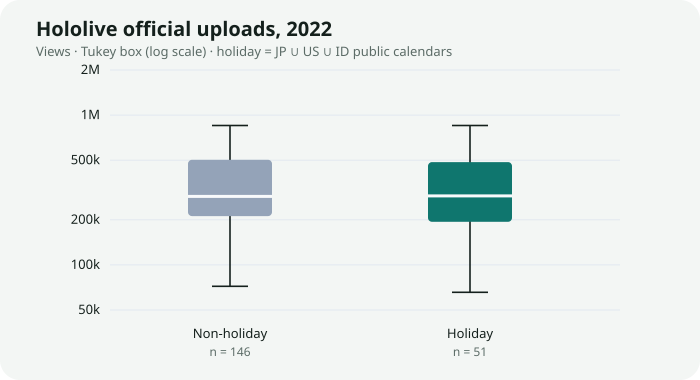
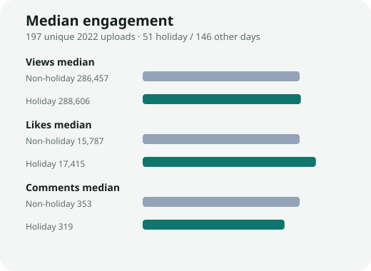
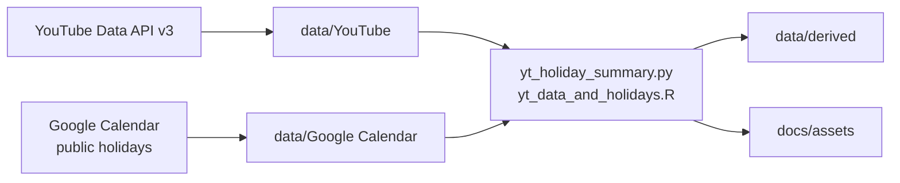

<p align="center">
  <a href="#readme"></a>
  <a href="docs/README.en.md"></a>
</p>

<p align="center">
  
</p>

<h1 align="center">Social Media Data Analysis</h1>

<p align="center">
  <strong>假日會不會改變官方頻道的互動量？</strong><br>
  YouTube Data API 抓上傳列，Google 公開假日曆對日期，R／Python 做探索分析。<br>
  2023 課程資料管線，2026 年收成可公開的 Showcase Repository。
</p>

<p align="center">
  
  
  
  
  
  
</p>

<p align="center">
  <a href="#功能">功能</a> ·
  <a href="#示範">示範</a> ·
  <a href="#架構">架構</a> ·
  <a href="#安裝">安裝</a> ·
  <a href="#專案結構">結構</a> ·
  <a href="#貢獻">貢獻</a> ·
  <a href="docs/README.md">文件索引</a> ·
  <a href="CHANGELOG.md">變更紀錄</a>
</p>

---

VTuber 事務所在假日發片，觀看會比較高嗎？這份作業用 **Hololive 官方頻道** 的公開上傳列，對上日本、美國、印尼的 **Google 公開假日曆**，看 2022 年「當天是不是假日」和觀看、喜歡、留言的關係。

> **現況。** 公開樹只保留官方 API 能重做的擷取與分析。登入式 X／Twitter 蒐集器、推文全文、未完成的平台對齊稿留在本機 `local/`，已被 git 忽略。本 Repository **不是** COVER / hololive 官方專案。

## 功能

<table>
<tr>
<td width="33%" valign="top">

### 官方 API 擷取

`src/fetching/youtube.py` 走 YouTube Data API v3，拉上傳播放清單的標題、日期、tags、觀看／喜歡／留言。`google_calendar.py` 讀各國公開假日曆。

</td>
<td width="33%" valign="top">

### 假日對照

日期先去重，再標「是否落在 JP ∪ US ∪ ID 假日」。同一天若三國都放假，影片只算一次，避免 join 爆列。

</td>
<td width="33%" valign="top">

### 可重跑摘要

Python 寫出 `data/derived/holiday_engagement_2022.csv` 與示範 SVG；R 腳本可再畫對數座標箱形圖。數字對得上才能進 README。

</td>
</tr>
</table>

| 還有這些 | 為什麼這樣做 |
| --- | --- |
| **本機材料與公開樹分開** | X 登入爬蟲與推文原文有平台條款與散布風險；半成品 tags 對齊也不該假裝做完。檔還在，只是不進 git。 |
| **兩套分析入口** | 沒裝 R 也能 `python src/analysis/yt_holiday_summary.py`。有 R 則走原本課程語系。 |
| **範例憑證、沒有真鑰** | `config.example/` 是空殼；真鑰放 `secrets/`，目錄已被忽略。 |
| **誠實寫發現** | 2022 官方頻道觀看中位數幾乎沒有假日差。作品寫「問了什麼」，不寫不存在的奇蹟。 |

## 示範

2022 年 Hololive 官方上傳去重後 **197** 支：假日 **51**、其餘 **146**。假日定義為日本、美國或印尼公開假日的聯集（原作業市場假設）。

| 組 | n | 觀看中位數 | 觀看平均 | 喜歡中位數 | 留言中位數 |
| --- | ---: | ---: | ---: | ---: | ---: |
| 假日 | 51 | 288,606 | 635,514 | 17,415 | 319 |
| 非假日 | 146 | 286,457 | 522,421 | 15,787 | 353 |

<p align="center">
  
</p>
<p align="center"><sub>Tukey 箱形圖、對數座標。離群值仍在資料裡，鬚線停在 1.5 IQR。</sub></p>

<p align="center">
  
</p>
<p align="center"><sub>觀看中位數幾乎重疊；喜歡略高、留言略低。這是探索描述，不是因果推論。</sub></p>

方法、限制與 Calliope Mori 對照見 [`docs/analysis.md`](docs/analysis.md)。

## 架構



| 層 | 位置 | 責任 |
| --- | --- | --- |
| 擷取 | `src/fetching/` | 官方 API；金鑰只讀 `secrets/` |
| 公開資料 | `data/YouTube`、`data/Google Calendar` | 可重跑的中介表 |
| 分析 | `src/analysis/` | 假日旗標、摘要、圖 |
| 本機 | `local/` | 不進版控的蒐集器、推文、半成品 |
| 說明 | `docs/` | 英文對照、方法、安裝細節 |

<details>
<summary><strong>技術細節（可折疊）</strong></summary>

<br>

- 原始 `Hololive.csv` 有 921 列、去重後 599 列（2019-02-19 至 2023-11-13）。分析窗只切 **2022-01-01～2022-12-31**。
- 原 R 稿用 `rbind` 三國假日再 `left_join`。同一天多國重疊會讓影片重複計入假日組。公開稿改成日期集合旗標。
- 假日曆只用 JP／US／ID，與原作業一致。TW、UK 表在 `data/Google Calendar/`，預設分析不合併。
- Tukey 1.5 IQR 修剪後，觀看中位數仍接近（假日 279,940、非假日 271,144）。結論不靠刪離群值才成立。
- `local/` 的路徑已改成讀 `local/data/X_Twitter/`，本機還跑得動，只是公開 clone 看不到那些檔。

</details>

## 安裝

需要 Python 3.10 以上。R 4.1 以上可選。金鑰請放在被忽略的 `secrets/`，不要提交。

```bash
python -m pip install -r requirements.txt
python src/analysis/yt_holiday_summary.py
```

可選（重畫 R 箱形圖）：

```bash
Rscript src/analysis/packages.R
Rscript src/analysis/yt_data_and_holidays.R
```

要自己重抓資料：把 [`config.example/`](config.example/) 複製成 `secrets/`，再跑 `src/fetching/youtube.py` 或 `google_calendar.py`。OAuth 與 API 配額寫在 [`docs/installation.md`](docs/installation.md)。

## 專案結構

```text
src/fetching/          YouTube、Google Calendar 擷取
src/analysis/          公開假日分析（Python + R）
data/YouTube/          官方頻道與 Calliope Mori 上傳列
data/Google Calendar/  JP / US / ID / TW / UK 2022 假日
data/derived/          重跑後的摘要表
docs/                  說明、Hero、示範圖；英文在 README.en.md
config.example/        憑證空殼
local/                 本機材料（gitignore，僅留 README）
LICENSE                Apache 2.0
CONTRIBUTING.md        貢獻約定
CHANGELOG.md           Keep a Changelog 2.0.0
```

為什麼 X 資料不進倉：[`local/README.md`](local/README.md)。完整樹狀與文件索引：[`docs/README.md`](docs/README.md)。

## 貢獻

這是封存的課程管線。歡迎修文件、補重跑註記、加強公開分析的統計檢定。請不要把 `local/`、`secrets/` 或推文全文推進公開分支。細節在 [`CONTRIBUTING.md`](CONTRIBUTING.md)。

## 授權

程式與文件：[Apache License 2.0](LICENSE) © 2023–2026 Naritaroad。

YouTube 標題、tags 與數量欄位來自 [YouTube Data API](https://developers.google.com/youtube/terms/api-services-terms-of-use)，所有權仍屬原上傳者與平台。Hololive、人才名與相關商標屬 COVER Corporation。本 Repository 僅供方法展示，不主張任何官方關係。

---

<p align="center">
  <sub>Coursework pipeline · 2022 window · packaged 2026</sub>
</p>
