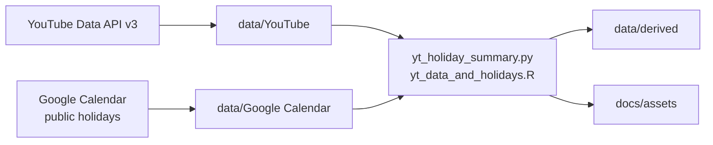

<p align="center">
  <a href="../README.md"></a>
  <a href="#readme"></a>
</p>

<p align="center">
  
</p>

<h1 align="center">Social Media Data Analysis</h1>

<p align="center">
  <strong>Do public holidays change official-channel engagement?</strong><br>
  YouTube Data API for the upload list, Google public holiday calendars for the dates, R and Python for the exploration.<br>
  A 2023 coursework pipeline, packed as a public showcase in 2026.
</p>

<p align="center">
  
  
  
  
  
  
</p>

<p align="center">
  <a href="#features">Features</a> ·
  <a href="#demo">Demo</a> ·
  <a href="#architecture">Architecture</a> ·
  <a href="#installation">Installation</a> ·
  <a href="#project-structure">Structure</a> ·
  <a href="#contributing">Contributing</a> ·
  <a href="./README.md">Docs index</a> ·
  <a href="../CHANGELOG.md">Changelog</a>
</p>

---

If a talent agency posts on a public holiday, do the views rise? This coursework takes the **Hololive official channel** upload list, aligns it with the **Google public holiday calendars** for Japan, the United States and Indonesia, and asks whether “the calendar day was a holiday” in 2022 tracks views, likes and comments.

English in this repository is **English**.

> **Status.** The public tree keeps only collectors that official APIs can reproduce. The login-based X/Twitter collector, the tweet dump and the unfinished cross-platform join stay in local `local/` and are gitignored. This repository is **not** an official COVER / hololive project.

## Features

<table>
<tr>
<td width="33%" valign="top">

### Official API collection

`src/fetching/youtube.py` uses YouTube Data API v3 for titles, dates, tags, views, likes and comments. `google_calendar.py` reads public holiday calendars.

</td>
<td width="33%" valign="top">

### Holiday flags

Dates are de-duplicated, then marked if they fall on the JP ∪ US ∪ ID holiday set. A day that is a holiday in three countries still counts a video once.

</td>
<td width="33%" valign="top">

### Repeatable summaries

Python writes `data/derived/holiday_engagement_2022.csv` and the demo SVGs. The R script can redraw a log-scale box plot. Figures in the README come from those numbers.

</td>
</tr>
</table>

| Also | Why |
| --- | --- |
| **Local materials stay local** | A login scraper and a tweet dump are a platform-policy and redistribution risk. An unfinished tag join should not pretend to be finished. The files remain; git does not take them. |
| **Two analysis doors** | No R? Run `python src/analysis/yt_holiday_summary.py`. R is still the original coursework dialect. |
| **Example credentials, no live keys** | `config.example/` is hollow. Real keys live in `secrets/`, which is ignored. |
| **Honest findings** | Median views on the official channel barely move on holidays. The piece reports the question, not a miracle. |

## Demo

After de-duplication, **197** Hololive official uploads in 2022: **51** holiday, **146** other days. A holiday is a date on the Japan, United States or Indonesia public calendars (the original market assumption).

| Group | n | Median views | Mean views | Median likes | Median comments |
| --- | ---: | ---: | ---: | ---: | ---: |
| Holiday | 51 | 288,606 | 635,514 | 17,415 | 319 |
| Other days | 146 | 286,457 | 522,421 | 15,787 | 353 |

<p align="center">
  
</p>
<p align="center"><sub>Tukey box plot on a log scale. Outliers remain in the data; whiskers stop at 1.5 IQR.</sub></p>

<p align="center">
  
</p>
<p align="center"><sub>Median views almost overlap; likes a little higher, comments a little lower. Descriptive, not causal.</sub></p>

Method, limits and the Calliope Mori contrast: [`analysis.en.md`](analysis.en.md).

## Architecture



| Layer | Where | Job |
| --- | --- | --- |
| Collect | `src/fetching/` | Official APIs; keys only from `secrets/` |
| Public data | `data/YouTube`, `data/Google Calendar` | Repeatable intermediates |
| Analyse | `src/analysis/` | Holiday flag, summary, figures |
| Local | `local/` | Collector, tweets and drafts that stay off git |
| Docs | `docs/` | English counterpart, method, install notes |

<details>
<summary><strong>Technical notes (collapsed)</strong></summary>

<br>

- Raw `Hololive.csv` has 921 rows; 599 after de-duplication (2019-02-19 to 2023-11-13). The analysis window is **2022-01-01 to 2022-12-31** only.
- The original R draft `rbind`-ed three calendars and `left_join`-ed. Overlapping holidays double-counted videos. The public draft uses a date-set flag.
- Only JP / US / ID calendars enter the flag, matching the coursework. TW and UK tables sit in `data/Google Calendar/` and are not merged by default.
- After a Tukey 1.5 IQR trim, median views stay close (holiday 279,940, other days 271,144). The reading does not depend on dropping outliers.
- Paths under `local/` now read `local/data/X_Twitter/`. They still run on the author’s machine; a public clone will not see those files.

</details>

## Installation

Python 3.10 or newer is required. R 4.1 or newer is optional. Put keys in ignored `secrets/`; do not commit them.

```bash
python -m pip install -r requirements.txt
python src/analysis/yt_holiday_summary.py
```

Optional (redraw the R box plot):

```bash
Rscript src/analysis/packages.R
Rscript src/analysis/yt_data_and_holidays.R
```

To collect again, copy [`config.example/`](../config.example/) to `secrets/` and run `src/fetching/youtube.py` or `google_calendar.py`. OAuth and quota notes: [`installation.md`](installation.md).

## Project structure

```text
src/fetching/          YouTube and Google Calendar collectors
src/analysis/          Public holiday analysis (Python + R)
data/YouTube/          Official channel and Calliope Mori uploads
data/Google Calendar/  JP / US / ID / TW / UK holidays for 2022
data/derived/          Regenerated summary table
docs/                  Notes, hero, demo figures
config.example/        Hollow credential files
local/                 Local materials (gitignore; README only)
LICENSE                Apache 2.0
CONTRIBUTING.md        Contribution rules
CHANGELOG.md           Keep a Changelog 2.0.0
```

Why the X dump is absent: [`../local/README.md`](../local/README.md). File index: [`README.md`](README.md).

## Contributing

This is an archived coursework pipeline. Fixes to the docs, replay notes, or a proper statistical test on the *public* analysis are welcome. Do not push `local/`, `secrets/` or tweet text onto a public branch. Details: [`../CONTRIBUTING.md`](../CONTRIBUTING.md).

## Licence

Code and documentation: [Apache Licence 2.0](../LICENSE) © 2023–2026 Naritaroad.

YouTube titles, tags and count fields come from the [YouTube Data API](https://developers.google.com/youtube/terms/api-services-terms-of-use). Rights remain with the uploaders and the platform. Hololive, talent names and related marks belong to COVER Corporation. This repository shows a method; it claims no official relationship.

---

<p align="center">
  <sub>Coursework pipeline · 2022 window · packaged 2026</sub>
</p>
